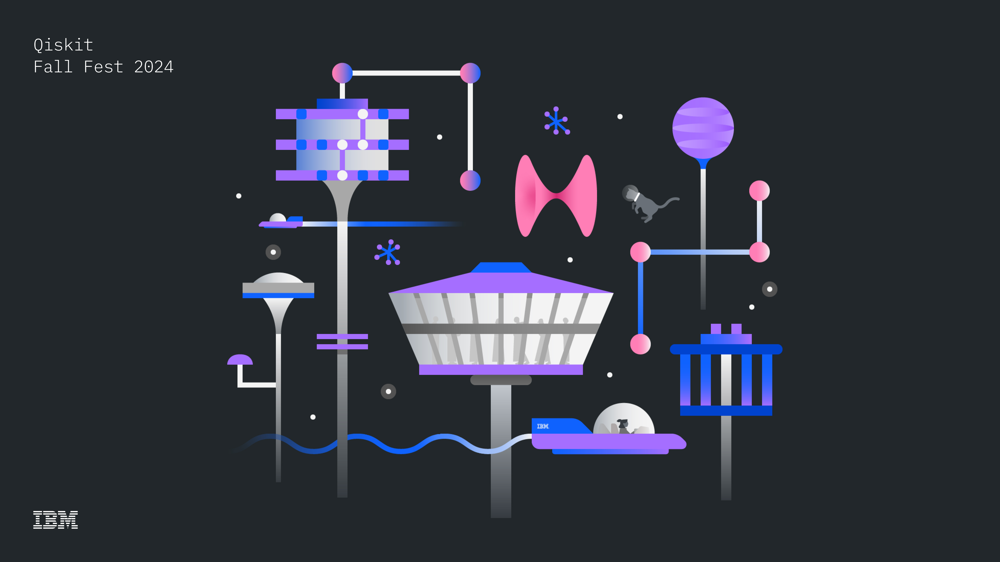
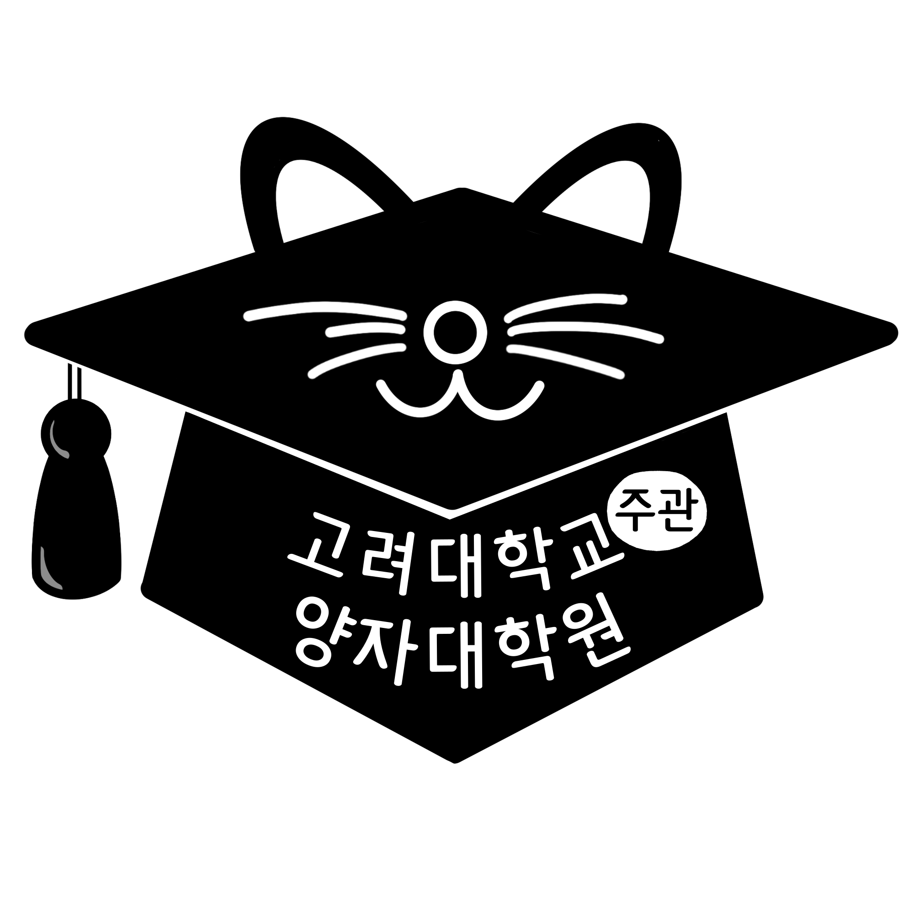
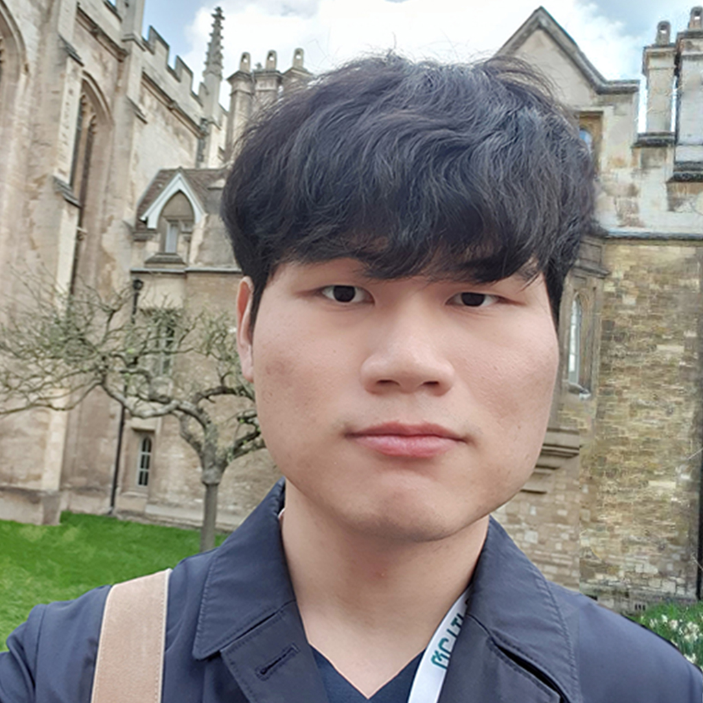
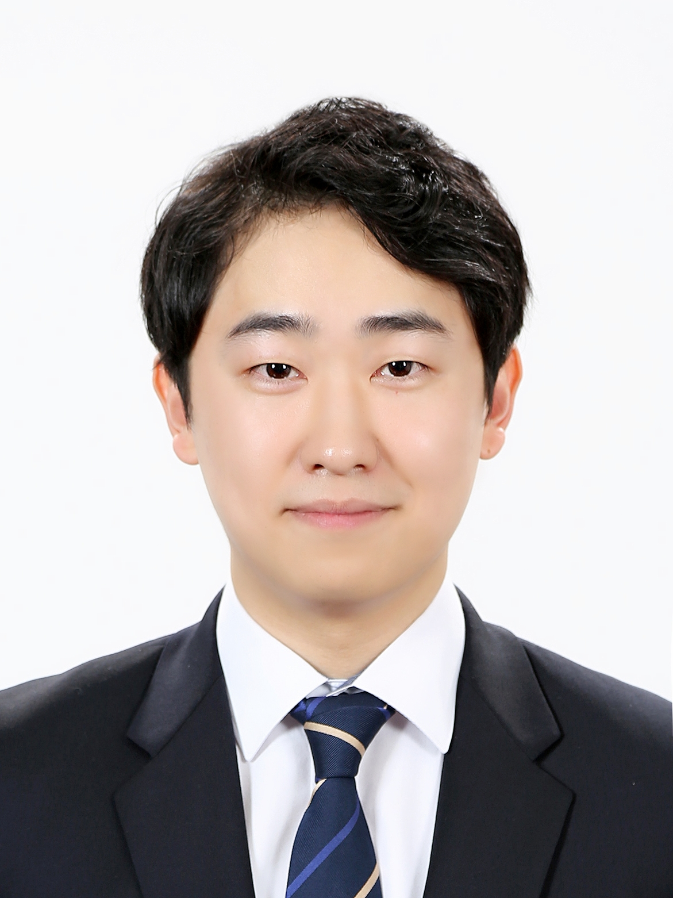
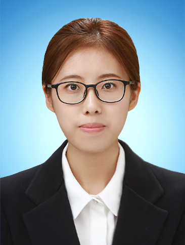
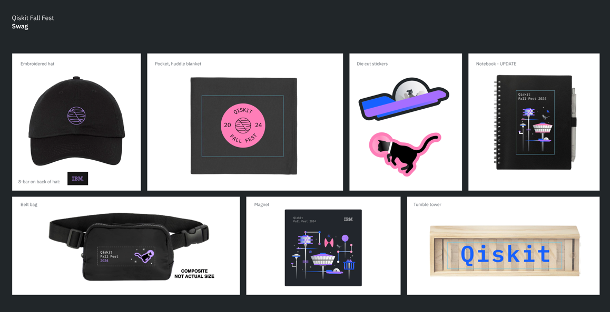

# qiskit-fall-fest-2024ku

"The explanation in English can be found below the Korean explanation"

## 환영합니다!

2024 Qiskif Fall Fest at Korea University 행사 안내 페이지입니다. 관심을 갖고 이 페이지를 봐주셔서 감사합니다! 이 행사는 IBM Quantum 의 도움을 받아 진행되며, 고려대학교 양자정보과학 학술동아리 [QUICK](https://quick.oopy.io/)(QUantum Information Club at Korea University)에서 기획하고 진행합니다. 이 행사는 고려대학교 학생들만을 위한 행사입니다!

Qiskit은 클라우드 시스템을 통해 양자 컴퓨터에 접근하고 양자 회로를 설계할 수 있도록 설계된 IBM이 개발한 오픈 소스 양자 컴퓨팅 프레임워크입니다.

양자컴퓨터에 잘 모르는 학생들이 양자컴퓨터에 관심을 가질 수 있도록 도와주는 것이 이번 행사의 목적입니다. "Challenge"의 형태로 행사를 진행할 예정이며, 참가자들은 도전 문제를 차근차근 풀어나가면서 양자컴퓨터를 다룰 수 있게 됩니다.

"Challenge" 란, 주최측이 제시하는 문제들을 풀어나가는 행사를 말합니다. 도전 문제들은 양자컴퓨터를 전혀 몰랐던 학생들도 풀 수 있는 아주 기본적인 문제를 시작으로 난이도가 점차 높아질 것입니다. 문제와 함께 문제를 풀기 위해 알아야할 내용에 대한 설명도 제시가 될 것입니다. 제공 되는 설명들을 보며 도전 문제를 풀어나가다보면, 양자컴퓨터를 활용하는 기초적인 능력을 갖추게 될 것입니다. 본격적인 "Challenge"를 하기 전에도 양자컴퓨터 분야를 소개하고 Qiskit을 이용하여 코딩하는 방법을 알려주는 워크숍도 진행됩니다.

2024 Qiskif Fall Fest at Korea University에서 참가자분들을 만나 뵐 수 있기를 기대하며, 양자컴퓨터에 대해 잘 모르시는 분도 대환영입니다! 양자컴퓨터가 무엇인지 궁금하신 분들은 주저하지 마시고 신청해주세요!

금전적, 행정적인 지원을 해주신 고려대학교(주관) 양자대학원에 감사 인사 드립니다.

## Support

## 일정

### 전체적인 일정표

| 시간(KST)             | 진행 방식 및 장소  | 내용        | 비고                                                  |
| --------------------- | ------------------ | ----------- | ----------------------------------------------------- |
| 11/2(토) 10:00~12:00  | online             | 킥오프 미팅 | 실시간 참여 혹은 녹화본 11/3(일) 오후 6시 전까지 시청 |
| 11/3(일) 19:00~21:00  | online             | 워크숍 1    | 실시간 참여 혹은 녹화본 11/4(월) 자정까지 시청        |
| 11/5(화) 19:00~21:00  | online             | 워크숍 2    | 실시간 참여 혹은 녹화본 11/6(수) 자정까지 시청        |
| 11/7(목) 18:00~21:00  | offline (장소 TBD) | 워크숍 3    | 오프라인으로 필수 참여                                |
| 11/9(토) 10:00~12:00  | online             | 워크숍 4    | 실시간 참여 혹은 녹화본 11/11(월) 자정까지 시청       |
| 11/12(화) 19:00~21:00 | online             | 워크숍 5    | 실시간 참여 혹은 녹화본 11/14(목) 자정까지 시청       |
| 11/15(금) 18:00~22:00 | offline (장소 TBD) | Challenge   |                                                       |

**온라인으로 진행되는 워크숍 녹화본은 각 워크숍 이후 제공될 예정입니다.**

**위 표의 비고란에 적힌 내용을 따르지 않을 경우 Challenge 참여가 제한될 수 있습니다**

### ✨ 킥오프 미팅 ✨

_Session Details: 11/2/2024(토), online, 10:00~12:00_

킥오프 미팅은 행사 주최자와 행사 참여자들이 온라인 상에서 처음으로 만나는 자리입니다. Qiskit Fall Fest at Korea University 의 자세한 일정에 대한 안내와 주의사항에 대해 안내드릴 예정입니다. 양자컴퓨터의 역사와 양자컴퓨터의 필요성에 대해서도 가볍게 다룰 것입니다.

### 💡 Qiskit Fall Fest 워크숍 1: 기초적인 선형대수 및 양자 회로 구성법 💡

_Session Details: 11/3/2024(일), online, 19:00~21:00_

첫번째 워크숍에서는 양자컴퓨터에서 연산이 어떻게 작동하는지 이해하기 위해서 필요한 수학적 배경지식 대하여 설명드릴 예정입니다. 이 시간에는 기초 선형대수, 단일 큐빗, 다중 큐빗 상태에 대해 배울 예정입니다. 고등학교 수학 정도만 알고 있어도 내용을 이해하실 수 있도록 기획하였으나, 1학년 수준의 기초 미적분학을 수강하셨거나, 선형대수를 배우신 적 있다면 더 이해하기 쉬우실 것입니다.

### 💡 Qiskit Fall Fest 워크숍 2: 양자컴퓨터로 무엇을 할 수 있을까? 💡

_Session Details: 11/5/2024(화), online, 19:00~21:00_

두번째 워크숍에서는 양자알고리즘 관점에서 양자컴퓨터를 이용하여 우리가 무엇을 할 수 있는지 다룹니다. 그로버 알고리즘(Grover's Algorithm), 양자 원격 전송(Quantum Teleportation)에 대해 자세히 설명드릴 예정입니다.

### 💡 Qiskit Fall Fest 워크숍 3: 연구원 초청 워크숍 💡

_Session Details: 11/7/2024(목), offline 장소 TBD, 18:00~21:00_

세번째 워크숍에서는 양자컴퓨터를 이용하여 우리가 무엇을 할 수 있는지, 그리고 양자컴퓨터 관련된 연구분야는 어떠한 것들이 있는지 소개해드릴 예정입니다. 양자정보과학 분야에서 연구하시는 연구원분들을 초빙하여 진행할 예정입니다. 연구원분들께서 진행하고 계신 분야에 대한 소개 및 양자컴퓨터를 사용하여 진행하였던 프로젝트에 대해 소개해주실 예정입니다.

### 💡 Qiskit Fall Fest 워크숍 4: Qiskit 사용 방법 💡

_Session Details: 11/9/2024(토), online, 10:00~12:00_

네번째 워크샵에서는 Qiskit 개발 환경을 설정하고 IBM의 양자 컴퓨터 및 시뮬레이터에서 양자 회로를 실행하는 방법에 대해 설명합니다.

### 💡 Qiskit Fall Fest 워크숍 5: Challenge 행사 시작 전 어떠한 것들을 준비하면 좋을까? 💡

_Session Details: 11/12/2024(화), online, 19:00~21:00_

다섯번째 워크숍에서는 11/15(금)에 진행되는 Challenge 행사에서 제시되는 도전문제 유형을 안내하고 도전문제 예시를 함께 풀어봅니다. Qiskit 개발 환경 설정에 어려움이 있으신 분들께서는 오프라인으로 오셔서 도움을 받으실 수 있습니다. 또한 Challenge 행상 전에 Qiskit과 양자컴퓨팅에 대해 공부하기 좋은 자료를 추천해드립니다.

### 🎉 Challenge: Main Event 🎉

_Event Details: 11/15/2024(금), offline 장소 TBD, 18:00~22:00_

| time        | content                     |
| ----------- | --------------------------- |
| 18:00~18:10 | 개회                        |
| 18:10~18:40 | 연사 초청 세션              |
| 18:40       | 도전 문제 공개 및 식사 제공 |
| 21:20       | 도전 문제 풀기 마감         |
| 21:20~21:30 | 시상식 준비                 |
| 21:30~22:00 | 시상 및 마무리              |

## 연사 소개

### 킥오프미팅

#### 김보성, Korea Technical Enablement Lead, IBM Quantum

_11/2/2024(토) 10:00_

주제:
- 양자컴퓨터란 무엇인가?
- 양자컴퓨터의 역사 및 양자컴퓨팅 산업 트렌드
- IBM Quantum의 비전

### 워크숍 3

#### 민건식, 고려대학교 전기전자공학부 [CIS 연구실](https://cislab.korea.ac.kr/)

_11/7/2024(목) 18:00_

주제:
- 양자정보과학 분야 동향
- CIS 연구실 소개

#### 강유진, 고려대학교 전기전자공학부 [CIS 연구실](https://cislab.korea.ac.kr/)

_11/7/2024(목) 18:30_

주제:
- 양자 오류 발생 및 그 오류를 해결하기 위한 QEC와 QEM

#### 노지민, 고려대학교 전기전자공학부 [AIM 연구실](https://aimlab-kuee.github.io/)

_11/7/2024(목) 19:10_

주제:
- 자율주행자동차와 양자머신러닝

### Challenge 개회

#### 윤은식, 고려대학교 물리학과 [KU-AQIL 연구실](https://aqil.korea.ac.kr)

_11/15/2024(금) 18:10_

주제:
- Rydberg quantum computer

### Challenge 시상 및 폐회

#### 박소미, APAC Quantum Innovation Centers, IBM Quantum

_11/15/2024(금) 21:30_

주제:
- 시상
- IBM 행사 및 교육 컨텐츠 소개

## ❗안내사항❗

### 이 행사에 참여하기 위해 필요한 배경지식

- 파이썬 코딩 경험
  - 조건문, 반복문, 함수 문법 등의 기초적인 파이썬 문법을 알고 계셔야 합니다.
  - class를 다뤄본 경험이 있으시면 더욱 좋습니다.
- 수학
  - 고등학교 수준의 확률, 벡터에 대한 지식이 있으셔야 합니다.
  - 행렬이 무엇인지 알고, 행렬 곱셈을 어떻게 하는지 알고 있어야 합니다.
  - 기초적인 선형대수 지식이 있으면 더욱 좋습니다.

### 참가자 준비물

- 개인 노트북, 충전기

### 참가자에게 제공되는 물품

- 석식, 다과
- 기념품
- 수료증(IBM, 고려대학교(주관) 양자대학원)

### IBM Quantum Community [행동강령](https://docs.quantum.ibm.com/open-source/code-of-conduct)

### 등록

- 마감기한: 10/30/2024(수) 23:59
- 참가비: 20,000 (등록 마감 이후 이메일과 문자를 통해 개별적으로 납부 안내할 예정)
- 모집 인원: 최대 40명
- 신청자가 많을 경우 조기 마감될 수 있습니다.
- 신청서를 성실히 작성하지 않으신 경우 Qiskit Fall Fest 참여가 어려우실 수 있습니다.
- 참가 신청서: [Google form](https://docs.google.com/forms/d/e/1FAIpQLSeI_eoVo3Wdje0CuVzaCoZXRj6Bjvm2L5jy-bKZXz05XmXRCw/viewform?usp=sf_link)

### 시상품

- 상위 3명에게 Qiskit Swag Pack 제공
- 상위 5명에게 상품 제공

### 문의사항 있는 경우

- 아래의 링크를 통해 카카오톡 오픈채팅방에서 문의해주시거나 e-mail을 통해 문의해주시길 바랍니다.
- open-kakao chatroom: [오픈 카카오톡 링크](https://open.kakao.com/o/sh2utbUg)
- e-mail: kuquickofficial@gmail.com

---

## Welcome!!

This is the event page for the 2024 Qiskit Fall Fest at Korea University. Thank you for your interest in our event! This event is hosted by [QUICK](https://quick.oopy.io/)(QUantum Information Club at Korea University) with the support of IBM Quantum.

Qiskit is an open-source quantum computing framework developed by IBM, designed to provide access to quantum computers via a cloud system and to facilitate quantum circuit design.

The goal of this event is to help students unfamiliar with quantum computing become interested in it. The event will be held in the form of a "Challenge," where participants will solve problems step by step and, in the process, learn how to work with quantum computers.

A "Challenge" refers to an event where participants solve problems presented by the organizers. The challenge problems will start with very basic tasks, so even students who have no prior knowledge of quantum computing can participate, and the difficulty will gradually increase. Along with the problems, explanations of the concepts needed to solve them will also be provided. As participants progress through the challenges using the provided explanations, they will acquire basic skills in utilizing quantum computers. Before diving into the "Challenge," there will also be workshop to introduce the field of quantum computing and demonstrate how to code using Qiskit.

We look forward to meeting the participants at the 2024 Qiskit Fall Fest at Korea University. You don't need to know much about quantum computers, so please don't hesitate to apply if you're curious about what quantum computers are!

## Support

## Schedule

### Summarized timetable

| Time(KST)              | type & place        | content         | note                                                                      |
| ---------------------- | ------------------- | --------------- | ------------------------------------------------------------------------- |
| 11/2(Sat) 10:00~12:00  | online              | kickoff meeting | Participate in real time or watch the recording until 18:00 on 11/3(Sun)  |
| 11/3(Sun) 19:00~21:00  | online              | Workshop 1      | Participate in real time or watch the recording unitl 23:59 on 11/4(Mon)  |
| 11/5(Tue) 19:00~21:00  | online              | Workshop 2      | Participate in real time or watch the recording unitl 23:59 on 11/6(Wed)  |
| 11/7(Thu) 18:00~21:00  | offline (Place TBD) | Workshop 3      | Participate in offline                                                    |
| 11/9(Sat) 10:00~12:00  | online              | Workshop 4      | Participate in real time or watch the recording unitl 23:59 on 11/11(Mon) |
| 11/12(Tue) 19:00~21:00 | online              | Workshop 5      | Participate in real time or watch the recording unitl 23:59 on 11/14(Thu) |
| 11/15(Fri) 18:00~22:00 | offline (Place TBD) | Challenge       |                                                                           |

### ✨ Kickoff meeting ✨

_Session Details: 11/2/2023(Sat), online, 10:00~12:00_

The kickoff meeting is the first online gathering between the event organizers and participants. We will provide details about the schedule for Qiskit Fall Fest at Korea University as well as important guidelines. We will also briefly cover the history of quantum computing and the need for quantum computers.

### 💡Qiskit Fall Fest Workshop 1: Introduction to Linear Algebra and Circuit Composition. 💡

_Session Details: 11/3/2024(Sun), online, 19:00~21:00_

We will explain the mathematical background needed to understand how computations work on a quantum computer. During this session, you will learn basic linear algebra, single-qubit states, and multi-qubit states. The content is designed to be understandable with only a high school-level math background, but if you have taken linear algebra course, it will be easier to grasp.

### 💡 Qiskit Fall Fest Workshop 2: What can we do with quantum computers? 💡

_Session Details: 11/5/2024(Tue), online, 19:00~21:00_

We will explore what can be achieved using quantum computers from a quantum algorithm perspective, focusing on Grover's Algorithm and Quantum Teleportation.

### 💡 Qiskit Fall Fest Workshop 3: Guest speaker session 💡

_Session Details: 11/7/2024(Thu), offline Place TBD, 18:00~21:00_

In the third workshop, we will introduce what we can achieve using quantum computers and explore various research areas related to quantum computing. We will invite researchers in the field of quantum information science to lead this session. They will provide an introduction to the areas they are working on and share insights into projects they have conducted using quantum computers.

### 💡 Qiskit Fall Fest Workshop 4: How to use Qiskit? 💡

_Session Details: 11/9/2024(Sat), online, 10:00~12:00_

We will explain how to set up the Qiskit development environment and how to run quantum circuits on IBM’s quantum computers and simulators.

### 💡 Qiskit Fall Fest Workshop 5: What do you have to prepare before starting the challenge? 💡

_Session Details: 11/12/2024(Tue), online, 19:00~21:00_

We will guide you through the types of challenge problems that will be presented during the Challenge event on 11/15(Fri) and solve example problems together. For those who have difficulty setting up the Qiskit development environment, offline support will be available. Additionally, we will recommend useful resources to study Qiskit and quantum computing before the Challenge event.

### 🎉 Challenge: Main Event 🎉

_Event Details: 11/15/2024(Fri), offline Place TBD, 18:00~22:00_

| time        | content                                 |
| ----------- | --------------------------------------- |
| 18:00~18:10 | Opening                                 |
| 18:10~18:40 | Guest speaker session                   |
| 18:40       | Challenge problem announcement & Dinner |
| 21:20       | End of challenge problem solving        |
| 21:20~21:30 | Award ceremony preparation              |
| 21:30~22:00 | Post-event survey & closing             |

## Speaker

### Kickoff meeting

#### Boseong Kim, Korea Technical Enablement Lead, IBM Quantum

_11/2/2024(Sat) 10:00_

Topic:
- What is a quantum comptuer?
- The history of quantum computers and trends in the quantum computing industry
- Vision of IBM Quantum

### Workshop3

#### Gunsik Min, Korea University [CIS Lab](https://cislab.korea.ac.kr/)

_11/7/2024(Thu) 18:00_

Topic:
- Trends of Quantum information science
- Introduction to the CIS Lab

#### Yujin Kang, Korea University [CIS Lab](https://cislab.korea.ac.kr/)

_11/7/2024(Thu) 18:30_

Topic:
- Quantum error occurrence and the QEC and QEM methods for addressing those errors

#### Emily Jimin Roh, Korea University [AIM Lab](https://aimlab-kuee.github.io/)

_11/7/2024(Thu) 19:10_

Topic:
- Fast Quantum Convolutional Neural Networks for Low-Complexity Object Detection in Autonomous Driving Applications

### Challenge Opening

#### Eunsid Yoon, Korea University [KU-AQIL Lab](https://aqil.korea.ac.kr)

_11/15/2024(Fri) 18:10_

Topic:
- Rydberg quantum computer

### Challenge Close

#### Somi Park, APAC Quantum Innovation Centers, IBM Quantum

_11/15/2024(Fri) 21:30_

Topic:
- Introduce IBM events and educational contents

## ❗Attendee Guide❗

### Background knowledge that participants need to know

- Python coding experience
  - You should be familiar with conditional statements, loops, and function syntax.
- Mathematical background
  - you should understand what probability is, the difference between scalars and vectors, and what a matrix is.
  - Basic knowledge of linear algebra is a plus.

### Participant Requirements

- Personal laptop, and charger

### Items Provided to Participants

- Dinner, Snacks
- Souvenirs
- Certificate(from IBM and School of Quantum at Korea University(HQ))

### IBM Quantum Community [Code of Conduct](https://docs.quantum.ibm.com/open-source/code-of-conduct)

### Registration

- Deadline: 10/30/2024(수) 23:59
- Participation fee: KRW 20,000 (After the registration deadline, payment instructions will be individually sent via email and text message.)
- Maximum quota of participants: 40
- Registration may close early if the number of applicants exceeds the limit.
- If the application form is not filled out properly, participation in the Qiskit Fall Fest may not be possible.
- Application form: [Google form](https://docs.google.com/forms/d/e/1FAIpQLSeI_eoVo3Wdje0CuVzaCoZXRj6Bjvm2L5jy-bKZXz05XmXRCw/viewform?usp=sf_link)

### Prizes

- Qiskit Swag Package to the Top 3 scorers
- Prize to the Top 5 scorers

### If You Have Any Questioon

- Please contact us through the Kakaotalk open chat linked below or via e-mail.
- Open-kakao chat room: [Open Kakaotalk link](https://open.kakao.com/o/sh2utbUg)
- e-mail: kuquickofficial@gmail.com